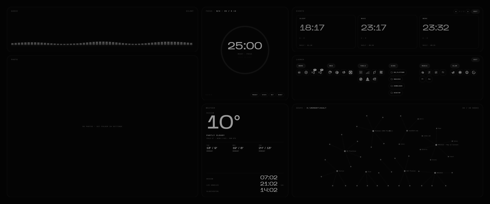
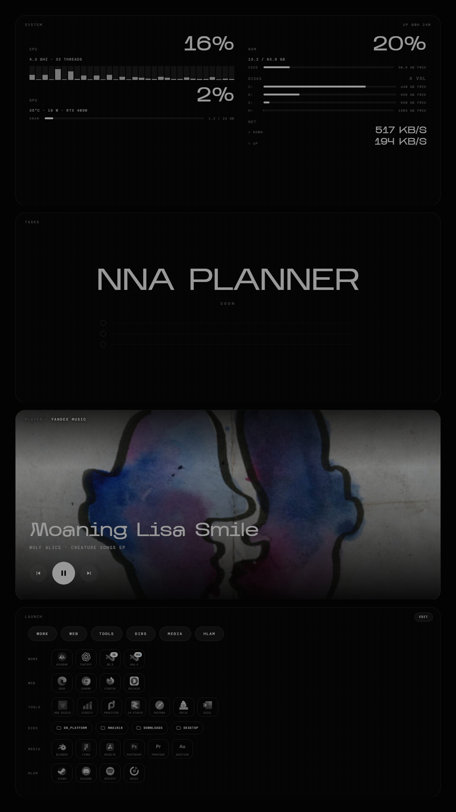
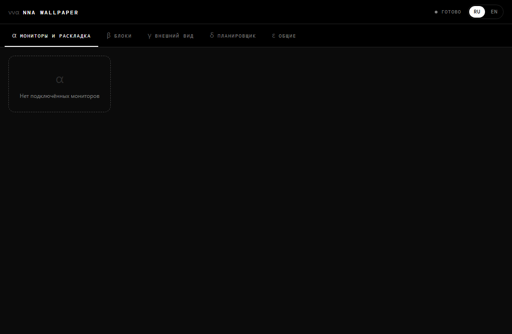

# NNA Wallpaper

Live interactive HTML wallpapers for Windows — without Wallpaper Engine.

NNA Wallpaper renders HTML/JS/CSS widgets directly behind the desktop icons (one WebView2 window
per monitor) and runs a small local host on `127.0.0.1` that feeds those widgets with system
stats, media info, an app launcher, weather, a folder graph and a live audio spectrum. Layout,
appearance and widgets are configured with the mouse in a settings window; an optional block
connects to NNA Planner over a Telegram login.





## Contents

- [Installation](#installation)
- [SmartScreen warning](#smartscreen-warning)
- [Requirements](#requirements)
- [First run](#first-run)
- [Command line](#command-line)
- [Settings](#settings)
- [Widgets](#widgets)
- [NNA Planner](#nna-planner)
- [Importing from an old wallpaper setup](#importing-from-an-old-wallpaper-setup)
- [Local API](#local-api)
- [Security](#security)
- [Where this came from](#where-this-came-from)
- [Documentation](#documentation)
- [License](#license)
- [NNA Wallpaper (RU)](#nna-wallpaper-ru)

## Installation

Download the latest release from
[GitHub Releases](https://github.com/immanuel1618/nna-wallpaper/releases):

- **`NNA.Wallpaper-win-Setup.exe`** — installs to `%LOCALAPPDATA%\NNA.Wallpaper` and auto-updates
  itself from GitHub Releases ([Velopack](https://velopack.io)).
- **`NNA.Wallpaper-win-Portable.zip`** — unzip anywhere and run `NNA.Wallpaper.exe`. Portable
  builds also self-update. Data is stored in `%LOCALAPPDATA%\NNA Wallpaper` by default, or next to
  the executable when started with `--data <folder>`.

## SmartScreen warning

Releases are **not** signed with a code-signing certificate. On first run Windows SmartScreen will
show "Windows protected your PC" / an "unknown publisher" warning. Click **More info → Run
anyway** to continue. This is expected and is not a defect in the build; a signed release would
require a paid certificate, which this project does not currently have.

## Requirements

- Windows 10 1809+ or Windows 11.
- [Microsoft Edge WebView2 Runtime](https://developer.microsoft.com/microsoft-edge/webview2/)
  (already present on Windows 11; the Setup installer does not bundle it).
- No separate .NET install — the app is a self-contained .NET 8 build.

## First run

On first launch the app places itself behind the desktop icons on every connected monitor with a
default layout, and adds a tray icon. Open settings with a double-click on the tray icon or with
`NNA.Wallpaper.exe --settings`.

## Command line

| Flag | Effect |
|---|---|
| *(none)* | Start the app, or bring an already-running instance to the front (single instance, mutex `NNA.Wallpaper`). |
| `--settings` | Open the settings window. |
| `--reload` | Reload configuration and refresh the wallpaper pages. |
| `--pause` / `--resume` | Pause / resume wallpaper rendering. |
| `--import <dir>` | Import configuration from an old-style wallpaper folder (see below). |
| `--exit` | Stop the running instance. |
| `--port <n>` | Local API port (default `1618`). |
| `--data <dir>` | Use `<dir>` instead of `%LOCALAPPDATA%\NNA Wallpaper` for configuration and data (portable mode). |
| `--headless` | Run the host without wallpaper windows (used by contract tests). |
| `--devtools` | Enable WebView2 DevTools. |
| `--check-updates` | Check for updates and exit. |

## Settings

The settings window (WebView2, `settings/index.html`) has five tabs:

1. **Monitors and layout** — per-monitor grid, drag-and-drop and resize of blocks, add/remove
   blocks, enable/disable a monitor, reset to default.
2. **Blocks** — a form generated from each widget's manifest (launcher items, events, photo
   folder, and so on).
3. **Appearance** — theme preset, palette, fonts, corner radius, blur, dim, FPS cap, pause under
   fullscreen apps.
4. **Planner** — NNA Planner login status and what to show on the desktop.
5. **General** — autostart, language (RU/EN), API port, updates, import, data folder, log,
   version and licenses.

Changes apply immediately to the running wallpaper. Full schema: [docs/SETTINGS.md](docs/SETTINGS.md).

## Widgets

A widget is a folder with a manifest: `widgets/<id>/widget.json` plus either `widget.js`
(rendered inside the wallpaper page) or `index.html` (rendered in a sandboxed iframe). Built-in
widgets ship under `widgets/` in the install folder; user widgets go in
`%LOCALAPPDATA%\NNA Wallpaper\widgets`. The app ships with ten built-in widgets: audio equalizer,
photos, focus timer, weather and clocks, events, launcher, folder graph, system stats, media
player, and the NNA Planner block. Writing your own: [docs/WIDGET-SDK.md](docs/WIDGET-SDK.md).

## Taskbar and top bar

The settings tab "Taskbar" styles the Windows taskbar (centered icons, hidden Search / Task View /
Widgets buttons and clock, auto-hide, transparency toggles; every Windows value is backed up and can
be restored with one click) and adds an optional **top bar**: a thin always-on-top strip at the top
edge of each monitor, like the macOS menu bar, with a clock, date, weather, system stats, the current
track and the planner counter. Windows start below it. Presets (`mac`, `clear`, `night`, `minimal`,
`windows`) ship with the app; your own presets are JSON files in `%LOCALAPPDATA%\NNA Wallpaper\presets\taskbar`.

Limitation: recent Windows 11 builds paint the taskbar background themselves, so the taskbar
transparency modes may have no visible effect there. The toggles and the top bar are unaffected.

## NNA Planner

The Planner block connects to [NNA Planner](https://planner.nna1618.com) through a Telegram
Login Widget opened in an in-app window
(`https://planner.nna1618.com/desktop/login.html`). The resulting session is stored locally,
encrypted with Windows DPAPI for the current user. Once signed in, the desktop block shows
today's and overdue tasks, upcoming meetings, habits, money spent today and a morning briefing;
clicking an item marks it done, and a text/voice input sends new entries the same way the
Telegram bot does. Details: [docs/PLANNER.md](docs/PLANNER.md).

## Importing from an old wallpaper setup

`NNA.Wallpaper.exe --import <folder>` imports launcher items, events, cached icons and widget
settings from a folder laid out like a previous Wallpaper Engine + Python helper setup:

```
<folder>\helper\launch.json
<folder>\helper\events.json
<folder>\helper\icons\*.png
<folder>\block\pin\               (photo widget source folder)
<folder>\shared\nna-config.js
```

Example (the only place in this document that shows a machine-specific path):
`NNA.Wallpaper.exe --import H:\brand\wallpaper`.

## Local API

The host exposes a local HTTP/WebSocket API on `http://127.0.0.1:1618/` (port configurable).
GET requests are open to the local machine; every other request needs the app's API token, sent
as the `X-Token` header or a `t` query parameter. See [docs/ARCHITECTURE.md](docs/ARCHITECTURE.md#local-api)
for the endpoint list.

## Security

- The API listens on `127.0.0.1` only.
- Non-GET requests require the local API token.
- No telemetry is collected or sent.
- No administrator rights are required or requested.
- No secrets are stored in this repository.

## Where this came from

NNA Wallpaper reimplements, as a self-contained Windows app, a desktop setup that used to combine
Wallpaper Engine with a Python helper process. It does not use or contain Wallpaper Engine or any
of its assets. The technique used to place windows behind desktop icons is implemented from
public Microsoft documentation (WebView2, Win32 window APIs); no code from Lively Wallpaper (GPL)
or any other GPL project is used or copied.

## Documentation

- [docs/ARCHITECTURE.md](docs/ARCHITECTURE.md) — process layout, desktop embedding, local API, distribution.
- [docs/WIDGET-SDK.md](docs/WIDGET-SDK.md) — widget manifest and contract.
- [docs/SETTINGS.md](docs/SETTINGS.md) — configuration file formats.
- [docs/PLANNER.md](docs/PLANNER.md) — NNA Planner login and data flow.
- [CONTRIBUTING.md](CONTRIBUTING.md) — building, testing, contribution rules.
- [THIRD-PARTY.md](THIRD-PARTY.md) — third-party packages and licenses.
- [CHANGELOG.md](CHANGELOG.md) — release notes.

## License

[MIT](LICENSE).

---

# NNA Wallpaper (RU)

Живые интерактивные обои для Windows из HTML-виджетов — без Wallpaper Engine.

NNA Wallpaper рисует HTML/JS/CSS-виджеты прямо за иконками рабочего стола (по одному окну
WebView2 на монитор) и держит небольшой локальный хост на `127.0.0.1`, который отдаёт виджетам
системные показатели, данные медиаплеера, список программ для запуска, погоду, граф папок и
живой аудио-спектр. Раскладка, внешний вид и виджеты настраиваются мышью в окне настроек;
отдельный блок подключается к NNA Planner через вход по Telegram.

## Установка

Скачайте последний релиз со страницы
[GitHub Releases](https://github.com/immanuel1618/nna-wallpaper/releases):

- **`NNA.Wallpaper-win-Setup.exe`** — устанавливает приложение в `%LOCALAPPDATA%\NNA.Wallpaper`
  и обновляется автоматически из GitHub Releases ([Velopack](https://velopack.io)).
- **`NNA.Wallpaper-win-Portable.zip`** — распакуйте в любую папку и запустите
  `NNA.Wallpaper.exe`. Portable-сборка тоже обновляется автоматически. Данные хранятся в
  `%LOCALAPPDATA%\NNA Wallpaper`, либо рядом с exe при запуске с `--data <папка>`.

## Предупреждение SmartScreen

Сборки **не подписаны** сертификатом. При первом запуске Windows SmartScreen покажет
предупреждение «Windows защитила ваш компьютер» / «Неизвестный издатель». Нужно нажать
**«Подробнее» → «Выполнить в любом случае»**. Это ожидаемо и не является дефектом сборки:
подпись требует платного сертификата, которого у проекта пока нет.

## Первый запуск

При первом запуске приложение встаёт за иконки рабочего стола на всех подключённых мониторах с
раскладкой по умолчанию и добавляет значок в трей. Настройки открываются двойным кликом по
значку в трее или командой `NNA.Wallpaper.exe --settings`.

## Настройки

Окно настроек (WebView2, `settings/index.html`) — пять вкладок: **Мониторы и раскладка**
(перетаскивание и растягивание блоков мышью по сетке), **Блоки** (форма из манифеста каждого
виджета), **Внешний вид** (тема, палитра, шрифты, скругление, размытие, затемнение, лимит FPS,
пауза под полноэкранными окнами), **Планировщик** (статус входа, что показывать) и **Общие**
(автозапуск, язык RU/EN, порт API, обновления, импорт, папка данных, лог, версия и лицензии).
Изменения применяются к обоям сразу.

## Виджеты

Виджет — это папка с манифестом: `widgets/<id>/widget.json` и либо `widget.js` (рисуется внутри
страницы обоев), либо `index.html` (рисуется в изолированном iframe). Встроенные виджеты лежат в
папке `widgets` внутри установки, пользовательские — в `%LOCALAPPDATA%\NNA Wallpaper\widgets`.
В комплекте десять встроенных виджетов: аудио-эквалайзер, фото, фокус-таймер, погода и часы,
события, запуск программ, граф папок, системные показатели, медиаплеер и блок NNA Planner.

## NNA Planner

Блок планировщика подключается к [NNA Planner](https://planner.nna1618.com) через вход по
Telegram Login Widget в окне приложения (`https://planner.nna1618.com/desktop/login.html`).
Сессия хранится локально и зашифрована через Windows DPAPI для текущего пользователя. После
входа блок на рабочем столе показывает задачи на сегодня и просроченные, ближайшие встречи,
привычки, траты за день и утренний брифинг; клик по пункту отмечает его выполненным, а поле
ввода текстом или голосом отправляет новую запись так же, как это делает Telegram-бот.

## Импорт из старой раскладки обоев

`NNA.Wallpaper.exe --import <папка>` импортирует список запуска, события, кэш иконок и настройки
виджетов из папки в старом формате (Wallpaper Engine + Python-помощник):

```
<папка>\helper\launch.json
<папка>\helper\events.json
<папка>\helper\icons\*.png
<папка>\block\pin\               (папка-источник для виджета фото)
<папка>\shared\nna-config.js
```

Пример (единственное место в этом документе, где приведён путь конкретной машины):
`NNA.Wallpaper.exe --import H:\brand\wallpaper`.

## Откуда это взялось

NNA Wallpaper переносит в самостоятельное Windows-приложение рабочий стол, который раньше
собирался из Wallpaper Engine и отдельного Python-помощника. Код и ресурсы Wallpaper Engine в
проекте не используются. Техника встраивания окна за иконки рабочего стола реализована по
публичной документации Microsoft (WebView2, Win32 API окон); код Lively Wallpaper (GPL) или
любого другого GPL-проекта не используется и не копируется.

## Лицензия

[MIT](LICENSE).
