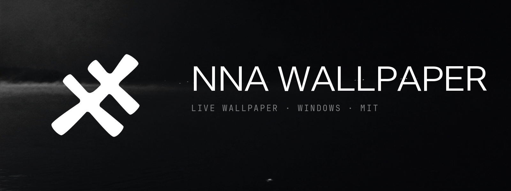
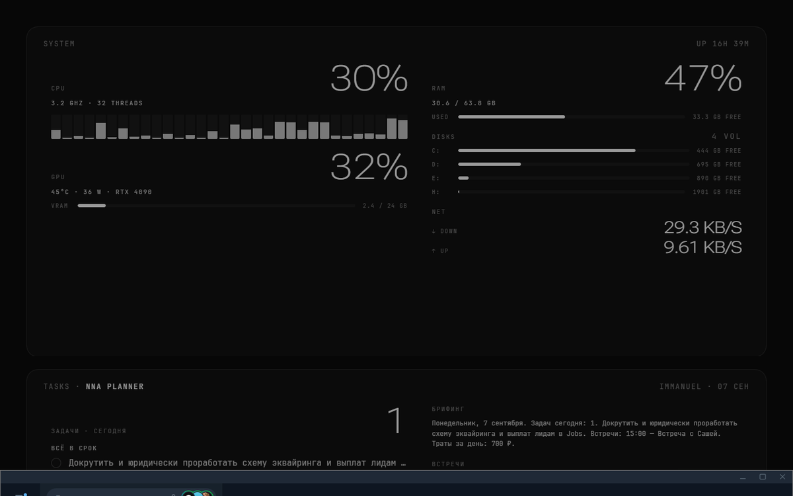
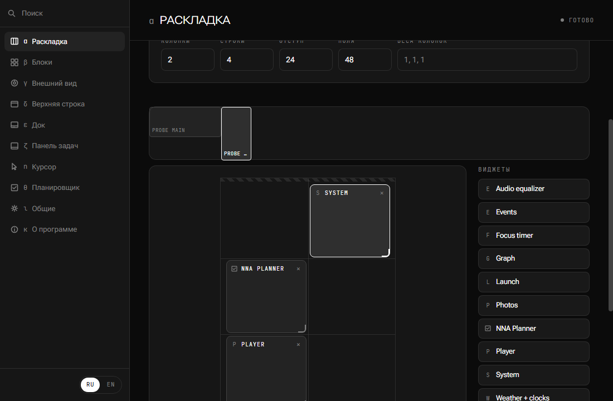
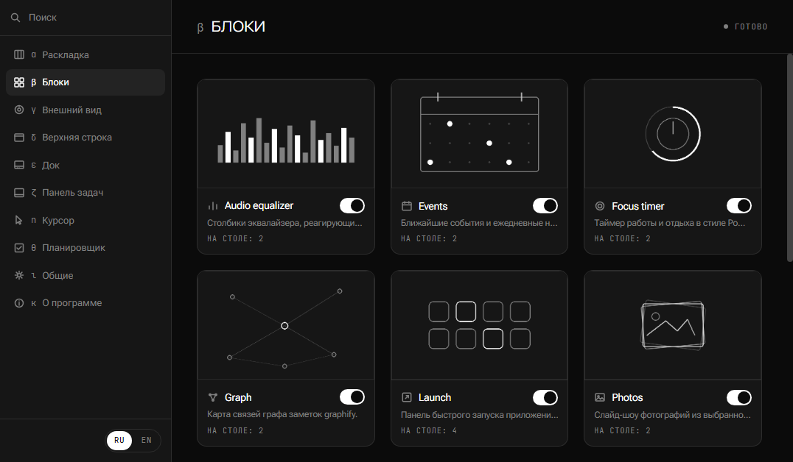
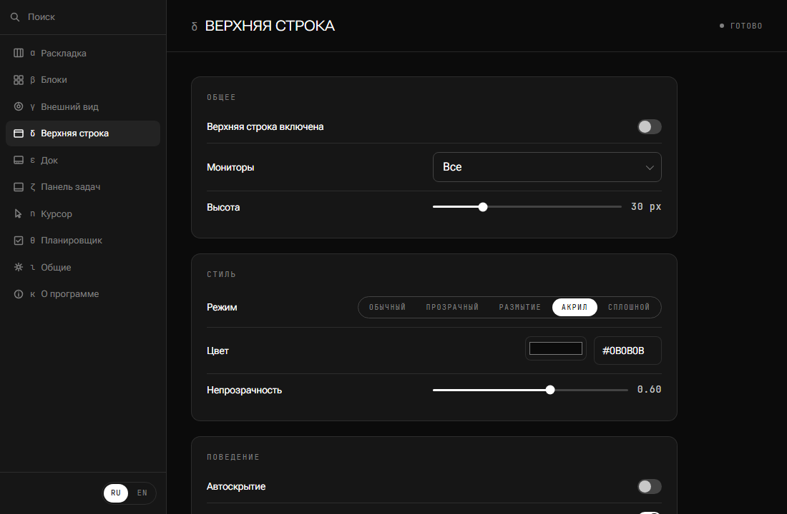
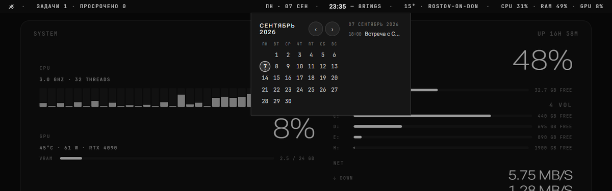
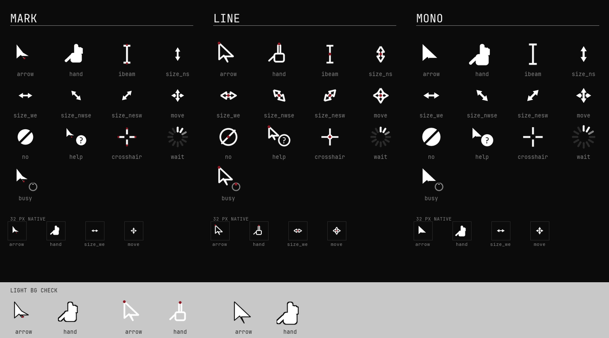

# NNA Wallpaper

Live interactive HTML wallpapers for Windows, without Wallpaper Engine.

## What it is

NNA Wallpaper is a self-contained Windows app that renders HTML/JS/CSS widgets directly behind
the desktop icons: one WebView2 window per monitor, embedded in the same way a desktop wallpaper
sits, with per-monitor DPI handling and input that reaches the page like any other window. A
small local host on `127.0.0.1` feeds those widgets with system stats, media info, an app
launcher, weather, a folder graph and a live audio spectrum. Layout, blocks, appearance, the top
bar, the dock, the taskbar and cursors are all configured with the mouse in a settings window that
looks and behaves like a native macOS-style preferences panel; changes reach the wallpaper the
same second, without reloading the page.

An optional block connects to [NNA Planner](https://planner.nna1618.com), a companion task,
habit and money-tracking service, over a Telegram login: today's tasks, meetings, habits, money
spent and a morning briefing on the desktop, with text and push-to-talk voice capture that files a
new entry the same way the Telegram bot does.

## Screenshots

| | |
|---|---|
|  |  |
|  |  |
|  |  |

## Install

Download the latest release from
[GitHub Releases](https://github.com/immanuel1618/nna-wallpaper/releases):

- **`NNA.Wallpaper-win-Setup.exe`** installs to `%LOCALAPPDATA%\NNA.Wallpaper`.
- **`NNA.Wallpaper-win-Portable.zip`** unzips anywhere; run `NNA.Wallpaper.exe`. With no `--data`
  flag it stores its data in `%LOCALAPPDATA%\NNA Wallpaper`, the same as the installed build;
  `--data <folder>` keeps everything next to the executable instead.

Both builds check GitHub Releases for an update once a day and from the tray menu / settings
window, and apply it in place through [Velopack](https://velopack.io).

Releases are not code-signed. On first run Windows SmartScreen shows "Windows protected your PC" /
an unknown-publisher warning; click **More info → Run anyway**. This is expected: a signed release
needs a paid code-signing certificate, which this project does not have. It is not a defect in the
build, and nothing about the warning changes once you click through it.

## First run

On first launch the app places itself behind the desktop icons on every connected monitor with a
default layout and adds a tray icon. Double-click the tray icon, or run
`NNA.Wallpaper.exe --settings`, to open settings.

Coming from an older wallpaper setup, `NNA.Wallpaper.exe --import <folder>` imports launcher
items, events, cached icons and widget settings from a folder laid out like a previous Wallpaper
Engine + Python helper setup (`helper/launch.json`, `helper/events.json`, `helper/icons/*.png`,
`block/pin/`, `shared/nna-config.js`).

To use the Planner block, open its settings page and sign in with the Telegram Login Widget; the
session is then stored locally and reused until you sign out.

## Features

### Wallpaper engine

One WebView2 window per monitor, hosted with WebView2's composition mode by default
(`engine.hosting`): mouse input goes through `SendMouseInput` rather than a plain child window, so
hover states on a widget never flicker as the cursor moves across the desktop. Settings changes
reach the running wallpaper over a live-update WebSocket channel and only the affected block
re-renders; the page is reloaded in full only when the set of monitors itself changes.

### Settings

A macOS-like settings shell: a searchable sidebar with pages for Layout, Blocks, Appearance, Top
bar, Dock, Taskbar, Cursor, Planner, General and About. The Layout page is a mouse-driven grid
editor (drag, resize, delete blocks, live preview on the desktop, Apply / Cancel, undo/redo,
keyboard support). The Blocks page shows a card per installed widget with a live or static
preview; opening a card shows its settings grouped by the widget's own manifest, each field with
plain-language help text.

### Top bar

An optional always-on-top strip at the top edge of each monitor, in the spirit of the macOS menu
bar: clock, date, weather, system stats, media, network, battery, keyboard layout, volume and the
Planner counter, each with its own popover (volume mixer, calendar, an NNA menu, Control Center).
Windows keep their work area below it.

### Dock

An optional mac-like dock at the bottom edge of a monitor (`app.dock`, off by default; the `mac`
preset turns it on): pinned and running apps with magnification, labels, a bounce animation on
launch, a separator, folder "fans" for quick browsing, and the Recycle Bin.

### Taskbar

Styling toggles for the Windows taskbar (centered icons, hidden Search/Task View/Widgets/clock,
small size, transparency modes, auto-hide), all backed up before the first change and restorable
with one click. A separate `win-only` mode hides the taskbar and additionally keeps it from
sliding out on hover; it reappears only while the Win key is held (together with Start) or the
mouse is actually over it. See **Keyboard hook and microphone** below for exactly what this mode
does and does not do.

### Cursors

Three brand cursor sets (mark, line, mono), applied under the current user's own
`HKCU\Control Panel\Cursors` registry key. The very first apply backs up whatever scheme was
already installed; reset restores it exactly, byte for byte.

### NNA Planner

Sign in once through a Telegram Login Widget opened in an in-app window; the resulting session
lives locally, encrypted with Windows DPAPI for the current user. The Planner settings page shows
your profile (Telegram avatar and name), day/week stats, and voice settings including the
push-to-talk hotkey (`Ctrl+Shift+Space` by default). Holding it records from the microphone and
sends the recording to the planner the same way typing or the Telegram bot would; releasing it
stops the recording. Details: [docs/PLANNER.md](docs/PLANNER.md).

### Widgets

A widget is a folder with a manifest: `widgets/<id>/widget.json`, plus either `widget.js`
(rendered inside the wallpaper page) or `index.html` (rendered in a sandboxed iframe). The app
ships with ten built-in widgets: audio equalizer, photos, focus timer, weather and clocks, events,
launcher, folder graph, system stats, media player, and the NNA Planner block. Writing your own:
[docs/WIDGET-SDK.md](docs/WIDGET-SDK.md).

## Keyboard hook and microphone

Two features touch input in ways worth calling out plainly:

- **`win-only` taskbar mode** installs a low-level Windows keyboard hook (`WH_KEYBOARD_LL`) to
  tell a bare tap of the Win key apart from a Win-based shortcut (Win+E, Win+D, and so on), which
  must not show the taskbar. The hook looks only at the virtual-key code of each event, keeps
  nothing beyond a one-shot "is Win currently down alone" flag, writes nothing to disk or to the
  log, and always passes every keystroke through unmodified (`CallNextHookEx`). It is removed
  automatically whenever the mode changes away from `win-only`, whenever the wallpaper is paused,
  and on exit.
- **Push-to-talk** records from the microphone only while `Ctrl+Shift+Space` (configurable) is
  held down, for at most 60 seconds. The captured audio is buffered in memory, never written to
  disk, and is sent only to the NNA Planner capture endpoint you are signed in to; releasing the
  key stops the recording immediately.

## Local API

The host exposes a local HTTP/WebSocket API on `http://127.0.0.1:1618/` (port configurable with
`--port`). GET/HEAD requests are open to the local machine; every other request needs the app's
API token as the `X-Token` header or a `t` query parameter. Full route reference:
[docs/API.md](docs/API.md).

## Privacy

- No telemetry is collected or sent, and no administrator rights are required or requested.
- The API listens on `127.0.0.1` only, and non-GET requests require the local API token.
- Everything the app stores lives locally under `%LOCALAPPDATA%\NNA Wallpaper\` (or next to the
  executable with `--data <folder>`):
  - `app.json`, `monitors.json`, `launch.json`, `events.json`: your own configuration.
  - `planner-session.json`: the NNA Planner login session, encrypted with Windows DPAPI for the
    current user.
  - `cache/avatar.jpg`: your cached Telegram avatar, once signed in.
  - `cursors-backup.json`: your original cursor scheme, saved before the first cursor apply.
  - `taskbar-backup.json`: your original Windows taskbar registry values, saved before the first
    taskbar style is applied.
  - `logs/app.log`: the app's own log; the API token is redacted before anything is written to
    it, and no other secret is ever logged.

## Build from source

Requirements: Windows 10/11, the .NET SDK pinned in [`global.json`](global.json) (currently
`9.0.300`), and Node.js for the JavaScript unit tests.

```
dotnet restore NNA.Wallpaper.sln
dotnet build NNA.Wallpaper.sln -c Release
dotnet test NNA.Wallpaper.sln -c Release
```

JavaScript unit tests run one file at a time (`node --test <folder>` does not work in this
environment):

```
node --test settings/tests/layout-model.test.mjs
node --test ui/tests/palette.test.mjs
```

Everything else under `tests/` (`*.ps1`, `*.mjs`) is a manual or CI probe against a running
instance, not part of `dotnet test`; see [docs/TESTING.md](docs/TESTING.md) for the full list and
what each one needs (a headless instance, a live desktop, or nothing but the repo itself).

## Contributing

See [CONTRIBUTING.md](CONTRIBUTING.md) for the repository layout, coding rules and how to add a
widget, a settings page or a top bar module.

## License

[MIT](LICENSE). Third-party packages and fonts: [THIRD-PARTY.md](THIRD-PARTY.md).

## Documentation

- [docs/ARCHITECTURE.md](docs/ARCHITECTURE.md): process layout, desktop embedding, composition
  hosting and input, distribution.
- [docs/API.md](docs/API.md): full local API route reference.
- [docs/WIDGET-SDK.md](docs/WIDGET-SDK.md): widget manifest and contract.
- [docs/SETTINGS.md](docs/SETTINGS.md): configuration file formats.
- [docs/DESIGN-SYSTEM.md](docs/DESIGN-SYSTEM.md): brand palette, type and the shared `ui/` components.
- [docs/TOPBAR.md](docs/TOPBAR.md), [docs/DOCK.md](docs/DOCK.md), [docs/TASKBAR.md](docs/TASKBAR.md), [docs/CURSORS.md](docs/CURSORS.md): each surface's design and API.
- [docs/PLANNER.md](docs/PLANNER.md): NNA Planner login and data flow.
- [docs/TESTING.md](docs/TESTING.md): every test and probe script, and how to run it.
- [CONTRIBUTING.md](CONTRIBUTING.md): building, testing, contribution rules.
- [THIRD-PARTY.md](THIRD-PARTY.md): third-party packages and licenses.
- [CHANGELOG.md](CHANGELOG.md): release notes.

---

# NNA Wallpaper (RU)

Живые интерактивные обои для Windows из HTML-виджетов, без Wallpaper Engine.

## Что это

NNA Wallpaper: самостоятельное Windows-приложение, которое рисует HTML/JS/CSS-виджеты прямо за
иконками рабочего стола: по одному окну WebView2 на монитор, с учётом DPI каждого монитора и
вводом, который доходит до страницы как до обычного окна. Небольшой локальный хост на
`127.0.0.1` отдаёт виджетам системные показатели, данные медиаплеера, список программ для
запуска, погоду, граф папок и живой аудио-спектр. Раскладка, блоки, внешний вид, верхняя панель,
док, панель задач и курсоры настраиваются мышью в окне настроек, устроенном как нативная панель
настроек macOS; изменения доходят до обоев в ту же секунду, без перезагрузки страницы.

Отдельный блок подключается к [NNA Planner](https://planner.nna1618.com) (сопутствующему
сервису задач, привычек и учёта трат) через вход по Telegram: задачи на сегодня, встречи,
привычки, траты и утренний брифинг на рабочем столе, с вводом текстом и голосом (push-to-talk),
который отправляет новую запись так же, как это делает Telegram-бот.

## Установка

Скачайте последний релиз со страницы
[GitHub Releases](https://github.com/immanuel1618/nna-wallpaper/releases):

- **`NNA.Wallpaper-win-Setup.exe`** устанавливает приложение в `%LOCALAPPDATA%\NNA.Wallpaper`.
- **`NNA.Wallpaper-win-Portable.zip`** распаковывается в любую папку; запустите
  `NNA.Wallpaper.exe`. Без флага `--data` данные хранятся в `%LOCALAPPDATA%\NNA Wallpaper`, как и
  у установленной сборки; `--data <папка>` держит всё рядом с exe.

Обе сборки проверяют GitHub Releases на обновление раз в сутки и по кнопке в трее/настройках, и
применяют его на месте через [Velopack](https://velopack.io).

Сборки не подписаны сертификатом. При первом запуске Windows SmartScreen покажет предупреждение
«Windows защитила ваш компьютер» / «Неизвестный издатель»: нужно нажать **«Подробнее» →
«Выполнить в любом случае»**. Это ожидаемо: подпись требует платного сертификата, которого у
проекта пока нет. Это не дефект сборки, и после клика ничего в предупреждении не меняется.

## Первый запуск

При первом запуске приложение встаёт за иконки рабочего стола на всех подключённых мониторах с
раскладкой по умолчанию и добавляет значок в трей. Настройки открываются двойным кликом по
значку в трее или командой `NNA.Wallpaper.exe --settings`.

При переходе со старой раскладки обоев `NNA.Wallpaper.exe --import <папка>` импортирует список
запуска, события, кэш иконок и настройки виджетов из папки в старом формате (Wallpaper Engine +
Python-помощник: `helper/launch.json`, `helper/events.json`, `helper/icons/*.png`, `block/pin/`,
`shared/nna-config.js`).

Чтобы включить блок планировщика, откройте его страницу настроек и войдите через Telegram Login
Widget; сессия сохраняется локально и используется до выхода.

## Возможности

**Движок обоев.** По одному окну WebView2 на монитор, по умолчанию в режиме composition-хостинга
(`engine.hosting`): ввод мыши идёт через `SendMouseInput`, а не через дочернее окно, поэтому
hover-состояния виджетов не мерцают при движении курсора. Изменения настроек доходят до обоев по
живому WebSocket-каналу, перерисовывается только изменённый блок; полная перезагрузка страницы
происходит только при изменении набора мониторов.

**Настройки.** Окно настроек в духе macOS: боковая панель с поиском и страницами Layout, Blocks,
Appearance, Top bar, Dock, Taskbar, Cursor, Planner, General, About. Страница Layout: редактор
сетки мышью (перетаскивание, изменение размера, удаление блоков, живой предпросмотр на рабочем
столе, Apply/Cancel, отмена и повтор, клавиатура). Страница Blocks показывает карточку с
превью для каждого установленного виджета; открытие карточки показывает его настройки, сгруппированные
по манифесту виджета, с понятной подсказкой у каждого поля.

**Верхняя панель.** Опциональная полоса поверх всех окон у верхнего края каждого монитора, в духе
менюбара macOS: часы, дата, погода, системные показатели, медиа, сеть, батарея, раскладка
клавиатуры, громкость и счётчик планировщика, у каждого свой попап (микшер громкости, календарь,
меню NNA, Control Center).

**Док.** Опциональный док у нижнего края монитора (`app.dock`, по умолчанию выключен; пресет
`mac` включает): закреплённые и запущенные программы с увеличением, подписями, анимацией запуска,
разделителем, «веерами» папок и корзиной.

**Панель задач.** Переключатели стиля панели задач Windows (по центру, скрыть поиск/Task
View/Widgets/часы, маленький размер, режимы прозрачности, автоскрытие), с резервной копией перед
первым изменением и восстановлением в один клик. Отдельный режим `win-only` скрывает панель
задач и не даёт ей выезжать при наведении; она появляется только при удержании Win (вместе со
Start) или когда курсор реально над ней. См. раздел «Хук клавиатуры и микрофон» ниже: что этот
режим делает и чего не делает.

**Курсоры.** Три фирменных набора курсоров (mark, line, mono) под текущим пользователем,
`HKCU\Control Panel\Cursors`. Первое применение сохраняет исходную схему; сброс восстанавливает
её byte в byte.

**NNA Planner.** Вход один раз через Telegram Login Widget в окне приложения; сессия хранится
локально, зашифрована Windows DPAPI для текущего пользователя. Страница настроек планировщика
показывает профиль (аватар и имя из Telegram), статистику дня и недели, настройки голоса, включая
хоткей push-to-talk (`Ctrl+Shift+Space` по умолчанию): при удержании идёт запись с микрофона и
отправка в планировщик так же, как при вводе текстом или через Telegram-бота; отпускание клавиши
останавливает запись. Подробности: [docs/PLANNER.md](docs/PLANNER.md).

**Виджеты.** Виджет: папка с манифестом (`widgets/<id>/widget.json`) и либо `widget.js`
(рисуется внутри страницы обоев), либо `index.html` (в изолированном iframe). В комплекте десять
встроенных виджетов: аудио-эквалайзер, фото, фокус-таймер, погода и часы, события, запуск
программ, граф папок, системные показатели, медиаплеер и блок NNA Planner. Как написать свой:
[docs/WIDGET-SDK.md](docs/WIDGET-SDK.md).

## Хук клавиатуры и микрофон

Две функции напрямую касаются ввода, и стоит сказать прямо, что они делают:

- **Режим панели задач `win-only`** ставит низкоуровневый хук клавиатуры Windows
  (`WH_KEYBOARD_LL`), чтобы отличить одиночное нажатие Win от сочетания с Win (Win+E, Win+D и
  так далее), которое не должно показывать панель задач. Хук смотрит только код клавиши в каждом
  событии, не хранит ничего, кроме одноразового флага «сейчас зажат один Win», ничего не пишет ни
  на диск, ни в лог, и всегда пропускает каждое нажатие дальше без изменений
  (`CallNextHookEx`). Он снимается автоматически при выходе из режима `win-only`, при паузе обоев
  и при выходе из приложения.
- **Push-to-talk** пишет с микрофона, только пока зажата клавиша `Ctrl+Shift+Space` (настраивается),
  не дольше 60 секунд. Записанный звук хранится в памяти, никогда не сохраняется на диск и
  отправляется только на точку приёма NNA Planner, в которую вы вошли; отпускание клавиши сразу
  останавливает запись.

## Локальный API

Хост отдаёт локальный HTTP/WebSocket API на `http://127.0.0.1:1618/` (порт настраивается флагом
`--port`). GET/HEAD-запросы открыты для локальной машины; любой другой запрос требует токена API
в заголовке `X-Token` или параметре `t`. Полный список маршрутов: [docs/API.md](docs/API.md).

## Приватность

- Телеметрия не собирается и не отправляется; права администратора не требуются и не запрашиваются.
- API слушает только `127.0.0.1`; любой запрос кроме GET требует токена.
- Всё, что хранит приложение, лежит локально в `%LOCALAPPDATA%\NNA Wallpaper\` (или рядом с exe
  при `--data <папка>`):
  - `app.json`, `monitors.json`, `launch.json`, `events.json`: ваши настройки.
  - `planner-session.json`: сессия входа в NNA Planner, зашифрована Windows DPAPI для текущего
    пользователя.
  - `cache/avatar.jpg`: кэш вашего аватара из Telegram после входа.
  - `cursors-backup.json`: исходная схема курсоров, сохранённая перед первым применением.
  - `taskbar-backup.json`: исходные значения реестра панели задач Windows, сохранённые перед
    первым применением стиля.
  - `logs/app.log`: лог приложения; токен API вычищается перед записью, других секретов в лог
    не попадает.

## Сборка из исходников

Нужны: Windows 10/11, .NET SDK версии из [`global.json`](global.json) (сейчас `9.0.300`), Node.js
для JS-тестов.

```
dotnet restore NNA.Wallpaper.sln
dotnet build NNA.Wallpaper.sln -c Release
dotnet test NNA.Wallpaper.sln -c Release
```

JS-тесты запускаются по одному файлу (`node --test <папка>` в этом окружении не работает):

```
node --test settings/tests/layout-model.test.mjs
node --test ui/tests/palette.test.mjs
```

Остальное в `tests/` (`*.ps1`, `*.mjs`): ручные или CI-пробы против запущенного экземпляра, не
часть `dotnet test`; полный список и что для каждой нужно, в [docs/TESTING.md](docs/TESTING.md).

## Участие в разработке

[CONTRIBUTING.md](CONTRIBUTING.md): структура репозитория, правила и как добавить виджет,
страницу настроек или модуль верхней панели.

## Лицензия

[MIT](LICENSE). Сторонние пакеты и шрифты: [THIRD-PARTY.md](THIRD-PARTY.md).
